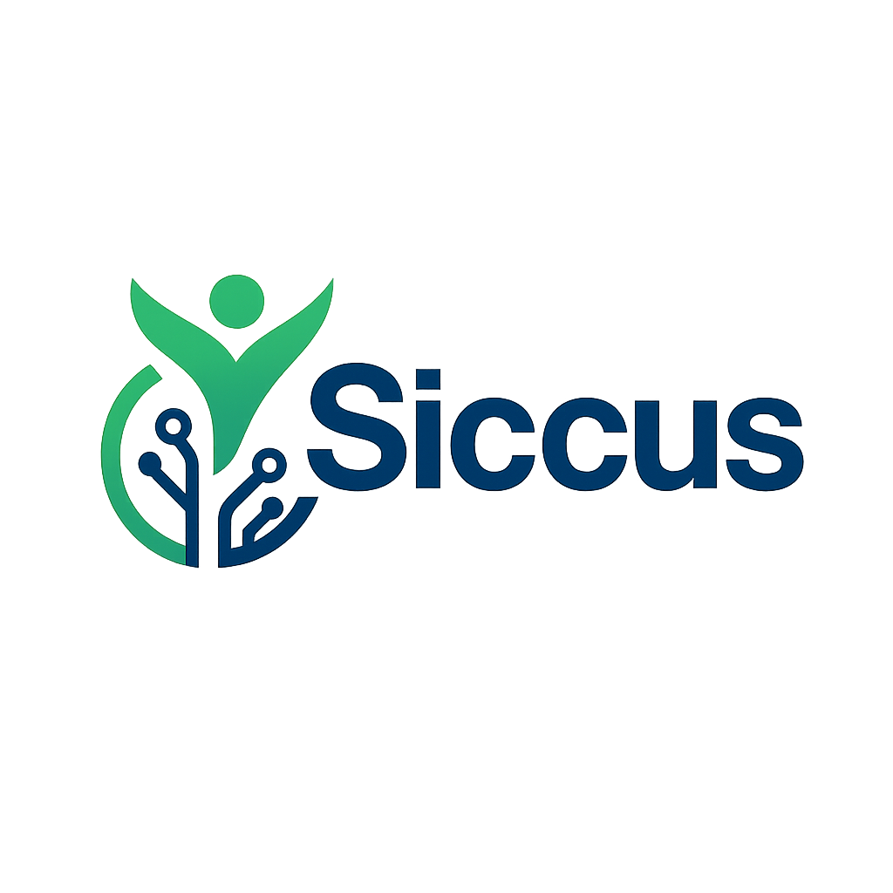

# Siccus

¡Bienvenido a Siccus! 🚀

Siccus es una aplicación web gamificada para ayudarte a mejorar tu salud y hábitos diarios de forma divertida y visual. Gestiona tu progreso, recibe recordatorios, desbloquea logros y mantén tu motivación al máximo.

## Características principales

- **Onboarding interactivo** para nuevos usuarios
- **Panel de control** con tu progreso, nivel y racha diaria
- **Perfil personalizable**
- **Recordatorios** para mantener tus hábitos saludables
- **Seguimiento de ejercicios**
- **Logros y recompensas**
- **Configuración de tema** (oscuro/claro)

## Tecnologías utilizadas

- [React](https://react.dev/)
- [TypeScript](https://www.typescriptlang.org/)
- [Vite](https://vitejs.dev/)
- [Tailwind CSS](https://tailwindcss.com/)

## Instalación y uso

1. Clona el repositorio:
   ```bash
   git clone https://github.com/Jhonier16s/siccus-frontend.git
   cd siccus-frontend
   ```
2. Instala las dependencias:
   ```bash
   npm install
   ```
3. Inicia el servidor de desarrollo:
   ```bash
   npm run dev
   ```
4. Abre tu navegador en [http://localhost:3000](http://localhost:3000)

## Estructura del proyecto

```
src/
  assets/           # Imágenes y recursos
  components/       # Componentes reutilizables
  styles/           # Estilos globales
  types/            # Tipos y definiciones
  App.tsx           # Componente principal
  main.tsx          # Punto de entrada
```

## Créditos y agradecimientos
- Diseño y desarrollo: Jhonier16s
- Iconos: [Lucide](https://lucide.dev/)
- Inspiración: Comunidad open source

---

¡Contribuciones y sugerencias son bienvenidas! Si encuentras un bug o tienes una idea, abre un issue o un pull request.

---

<p align="center">
  
</p>
